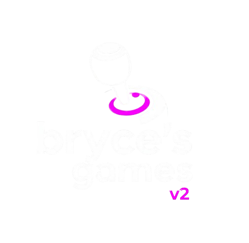

<kbd>

</kbd>

<h1 align="left">bryce's games - v2 (newest release)</h1>

the best school site for games, resources, unblocked searching, chatting, and more.

## 

## features

- tab cloaking & about:blank
- free proxy
- SPEED
- lightweight
- pwa support
- and even more

## files

official game files and the cdn base are hosted at [this repo](https://gitlab.com/kaioxdev/legacy-assets).

<!-- ## Host the CDN

Thanks to [@Russell2259](https://github.com/Russell2259/) in the previous version,  you can host your CDN. Instructions are [here](https://3kh0.gitbook.io/wiki/create-a-cdn-server-for-3kh0).

## Host the website

You can host our website on a cloud hosting solution like Vercel here. If you're unsure on what this does, use our own site, or find one someone else is hosting.  

 

## Themes 

To create your own theme, check out the themes.css file on the repo. In there you will find existing themes that you can modify. More documentation can be found [here](http://3kh0.gitbook.io/wiki/create-theme-code). -->

## Contributors

<!--
## Previous versions

Here are the previous iterations of this project. All credits to 3kh0 and all of the amazing people that helped work on the iterations of this project.

- [v1](https://github.com/3kh0/website-v1)
- [v2](https://github.com/3kh0/website-v2)
- [v3](https://github.com/3kh0/website-v3)
- [v4](https://gitlab.com/3kh0/website-v4)

## License
View the license [here](LICENSE.txt). --:

